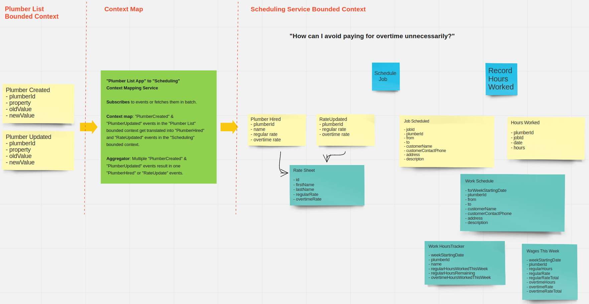

# Eventsourcing Explored: Full Moon Plumbing

_Full Moon Plumbing is a sample application we designed and partly implemented for https://www.meetup.com/DDD-CQRS-ES/events/234682720/_

A fictitious plumbing business needed a way to schedule plumbers. Having a good overview of who's available and who is scheduled for what
appointment was important, but the core domain (the part which Full Moon Plumbing wanted to be really good at ...) was:

> "How do I avoid paying for unnecessary overtime?"

As usual in the first session, we did an introduction to event sourcing, CQRS and domain driven design followed by an event storming:

Higher-res image: https://raw.githubusercontent.com/Adaptech/fullmoonplumbing/master/FullMoonPlumbingEventStorm.png



(About the Aggregator pattern used in the context map: http://www.enterpriseintegrationpatterns.com/patterns/messaging/Aggregator.html )

## Eventsourcing: How About Some Spreadsheets?

The Plumber List "legacy system" is done in Google Sheets, including the API which makes "PlumberCreated" and "PlumberUpdated" events
available to the Full Moon Plumbing scheduling service. 

> It is a tongue-in-cheek attempt to show that we are overcomplicating eventsourcing.

> It is also an attempt to reduce time spent coding low-value CRUD. 

## Getting Started

### Installing the Plumber List Google Sheet

1. In Google Sheets, create a new sheet.
2. In "File->Import", upload ```./PlumberList/Full Moon Plumbing.ods```.
3. In "Tools -> Script Editor", replace the boilerplate code in Code.gs with the content of ```./PlumberList/Code.gs````.

Try editing some Plumber info.

### Exposing the Plumber List "API"

1. In the Google Sheet, go to "File -> Publish to the web".
2. Under "Link", select "Event Log" instead of "Entire Document". Select "Comma-separated values (.csv)" instead of "Web Page".
3. Copy the link. 

For an example, see https://docs.google.com/spreadsheets/d/1DDpscPOD_ey9bAT6W7weGIPMiejOsKgY1s5v12oemaU/pub?gid=1115265347&single=true&output=csv .

Published Google Sheets are updated every 5 minutes, so if that meets your Service Level Agreement for eventual consistency, you can just download
the .csv file every few minutes or so to get the new events. Itempotency is important because this is the entire list, including all events 
previously downloaded. 

### Publishing a read-only "Plumber List Website"

1. In the Google Sheet, go to "File -> Publish to the web".
2. Under "Link", select "Entire Document" and "Web Page.
3. Copy the link. 

For example: https://docs.google.com/spreadsheets/d/1DDpscPOD_ey9bAT6W7weGIPMiejOsKgY1s5v12oemaU/pubhtml 

> The "API" and the Plumber List Website are public because Full Moon Plumbing is more than merely fictional. It is a Maximum Transparency Business. 
